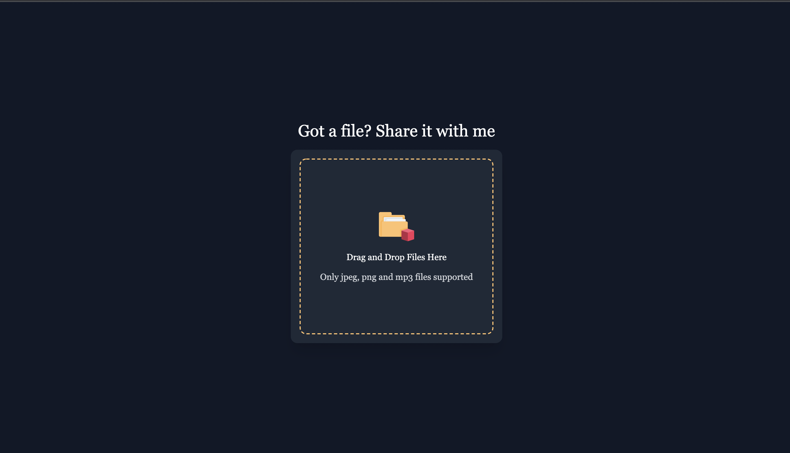

<h1 align="center">EraShare</h1>
<p align="center">Simple File Sharing App for Normies!</p>
<p align="center">


<p align="center">
  
</p>

# EraShare

- File Sharing app to exclusively share image and sound files between customers.
- Send file download links to customers via Email.

#### [Backend  Repository](https://github.com/AnimeshRy/erashare-backend)
### Stack
- Next JS (Frontend)
- Tailwind (Styling)
- Express (Backend)
- Typescript
- MongoDB Atlas (Database)
- Cloudinary (Image Store)
- SENDINBLUE (Email Service)
- Deloyment - Heroku (Backend) Vercel (Frontend)


This is a [Next.js](https://nextjs.org/) project bootstrapped with [`create-next-app`](https://github.com/vercel/next.js/tree/canary/packages/create-next-app).

## Setup Frontend

First, run the development server:

```bash
git clone https://github.com/AnimeshRy/erashare-frontend.git
npm run dev
```

Open [http://localhost:3000](http://localhost:3000) with your browser to see the result.

## Learn More

To learn more about Next.js, take a look at the following resources:

- [Next.js Documentation](https://nextjs.org/docs) - learn about Next.js features and API.
- [Learn Next.js](https://nextjs.org/learn) - an interactive Next.js tutorial.

You can check out [the Next.js GitHub repository](https://github.com/vercel/next.js/) - your feedback and contributions are welcome!

## Deploy on Vercel

The easiest way to deploy your Next.js app is to use the [Vercel Platform](https://vercel.com/new?utm_medium=default-template&filter=next.js&utm_source=create-next-app&utm_campaign=create-next-app-readme) from the creators of Next.js.

Check out our [Next.js deployment documentation](https://nextjs.org/docs/deployment) for more details.

#### [MIT License](https://github.com/AnimeshRy/erashare-frontend/blob/main/LICENSE)
